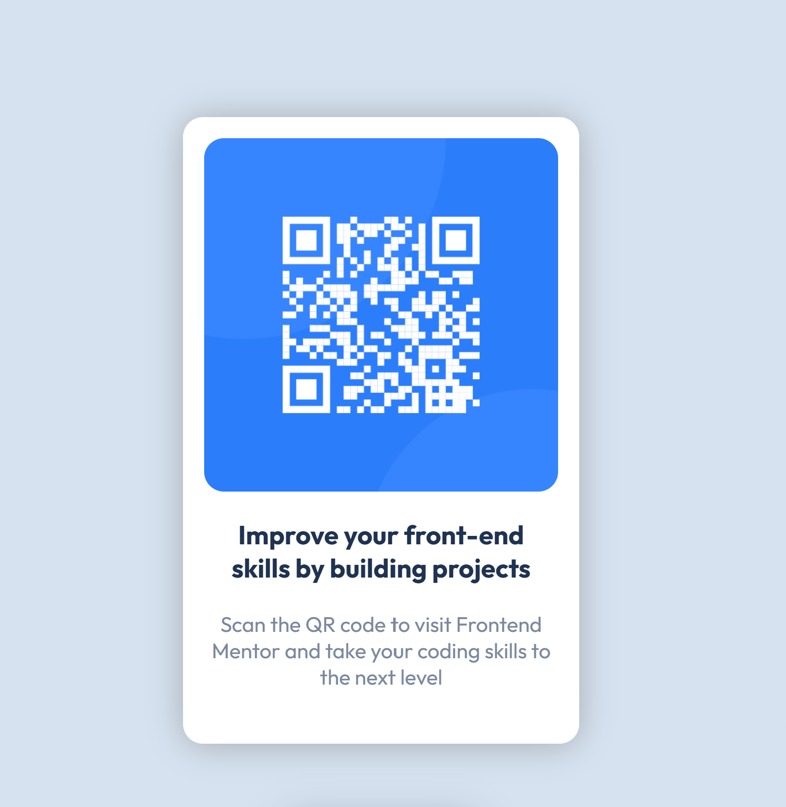

# QR Code Component Solution

This is a solution to the [QR code component challenge on Frontend Mentor](https://www.frontendmentor.io/challenges/qr-code-component-iux_sIO_H). Frontend Mentor challenges help you improve your coding skills by building realistic projects.

## Table of contents
- [Overview](#overview)
  - [Screenshot](#screenshot)
  - [Links](#links)
- [My process](#my-process)
  - [Built with](#built-with)
  - [What I learned](#what-i-learned)
  - [Continued development](#continued-development)
  - [Useful resources](#useful-resources)
- [Author](#author)
- [Acknowledgments](#acknowledgments)

## Overview

### Screenshot

### Links
- [Solution URL](https://github.com/michealmcdon/qr-code-component)
- [Live Site URL](https://qr-code-component-seven-dusky.vercel.app/)

## My process

### Built with
- Semantic HTML5 markup
- CSS custom properties
- Flexbox
- Mobile-first workflow

### What I learned
Improved my CSS Flexbox skills.

### Continued development
Further enhance responsiveness and add detailed styling and animations in future projects.

### Useful resources
- [MDN Web Docs for Flexbox](https://developer.mozilla.org/en-US/docs/Web/CSS/CSS_Flexible_Box_Layout/Basic_Concepts_of_Flexbox) - This helped me understand the basics and advanced concepts of Flexbox.

## Author
- Frontend Mentor - [@michealmcdon](https://www.frontendmentor.io/profile/michealmcdon)

## Acknowledgments
Thanks to Frontend Mentor for the design and challenge. Shoutout to the community for their support and feedback.
